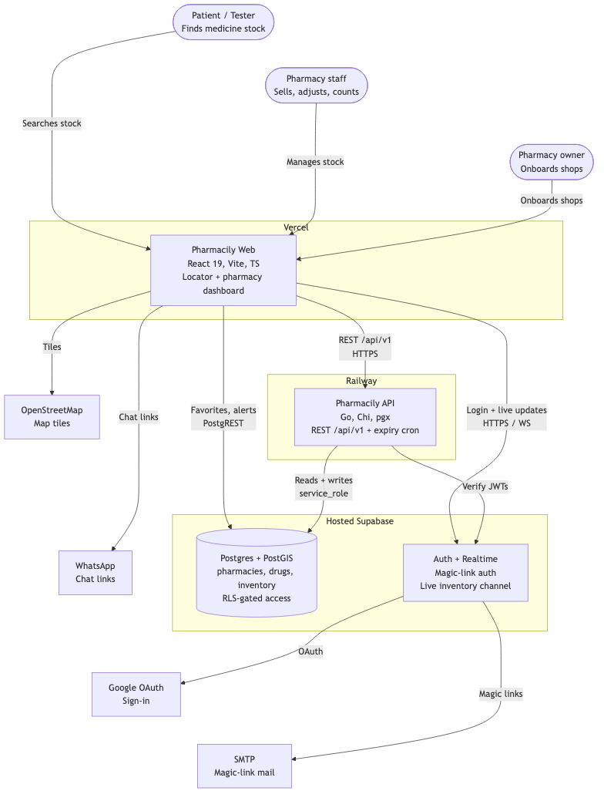
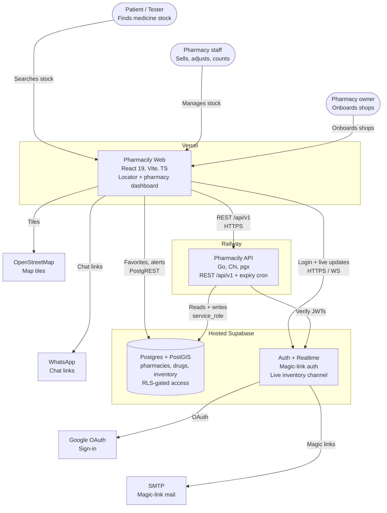

# Pharmacily architecture

## System design (staging)

SVG version: [system-design.svg](system-design.svg) · Source: [system-design.mmd](system-design.mmd)

## Provenance

- Generated 2026-09-17 via [archy-mcp](https://github.com/phxdev1/archy-mcp)
  (cloned to `~/dev/archy-mcp`, built from source).
- Finding: archy's `generate_diagram_from_github` and
  `generate_diagram_from_text` return canned template output that ignores
  their inputs (GitHub run returned a generic "A software system" C4; text
  run returned an "Internet Banking System" diagram for a pharmacy
  description). The boxes and edges above were therefore authored from the
  repo itself — verified against `vercel.json`, `railway.toml`,
  `Dockerfile`, `internal/config/config.go`, `supabase/migrations/` and
  `AGENTS.md` — and rendered with the Mermaid toolchain.
- The AI-powered archy tools (`generate_diagram_from_code`,
  `generate_diagram_from_text_with_ai`) require an `OPENROUTER_API_KEY` and
  were not exercised. If you want archy registered persistently in
  `~/.config/opencode/opencode.json`, say so — otherwise it stays a
  one-shot setup at `~/dev/archy-mcp` (`node build/src/index.js`; note the
  upstream `npm run build` is broken — `tsc` output in `build/src/` is what
  runs).
